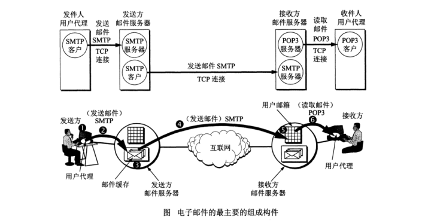

## 协议的重要性
计算机之间要实现通信，除了技术支持还需要一些规则来进行信息匹配，方能进行交流。不同的厂商生产不同的计算机，其CPU等内部构造不尽相同.
就好比两个外国人，那么计算机或者说外国人之间需要实现通信或交流，那么两者之间就需要学会同一种交流规则，对于两个外国人来说，这种交流规则就是语言.
而对于计算机来说，这种交流规则就是各种协议。协议的出现让不同厂商之间生产的计算机只要能够支持同一种协议就能实现正常通信，进行交流。

TCP/IP（TCP/IP Protocol Suite，或TCP/IP Protocols，传输控制协议/网际协议）是指能够在多个不同网络间实现信息传输的协议簇。TCP/IP协议不仅仅指的是TCP 和IP两个协议，而是指一个由FTP、SMTP、TCP、UDP、IP等协议构成的协议簇， 只是因为在TCP/IP协议中TCP协议和IP协议最具代表性，所以被称为TCP/IP协议。

TCP/IP提供了点对点链接的机制，将资料应该如何封装、寻址、传输、路由以及在目的地如何接收，都加以标准化。它将软件通信过程抽象化为四个抽象层，采取协议堆栈的方式，分别实现出不同通信协议。协议族下的各种协议，依其功能不同，分别归属到这四个层次结构之中[7][8]，常视为是简化的七层OSI模型

# TCP/IP协议族
## OSI七层模型

UDP适用/应用场景：
UDP 适用于需要快速传输少量数据的场景，因为它不会建立连接，所以传输效率比较高。

UDP 通常用于实时应用程序，比如视频会议、在线游戏、语音聊天等，因为这些应用程序通常要求实时性比较高，而且数据包丢失对应用程序的影响也不是很大。

UDP 还可以用于一些控制信息的传输，比如路由协议、DNS 协议等。

总的来说，UDP 适用于对数据传输速度要求较高，对数据完整性要求较低的场景。

### 电子邮件协议
作用：保证电子邮件正常发送和接收的一套规则和约定。
电子邮件协议有SMTP、POP3、IMAP4，都隶属于TCP/IP协议簇，默认状态下，分别通过TCP端口25、110和143建立连接。

只要区别：
SMTP用于发送邮件，POP3和IMAP用于接收邮件，IMP4用于拓展邮件功能。

